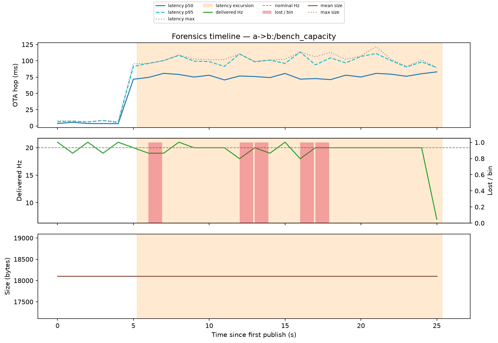

# Degradation Forensics Report

`rosotacom report` turns one recorded session instance into an explanation:
**where** in time delivery degraded, **how** (loss burst, latency excursion,
rate collapse), and **with what context** (link-trace samples, active network
profile segment, pipeline state transitions, traffic/keyframe bursts). It is
offline post-run analysis only — a pure projection of artifacts the run already
wrote, with no new instrumentation and no live mode.

```bash
rosotacom report session-instances/<day>/<instance>            # markdown summary
rosotacom report session-instances/<day>/<instance> --json     # report.json to stdout
```

Outputs are written to `<instance-dir>/report/` (override with `--out`):

- `report.json` — machine-readable: provenance, per-stream summaries, per-stream
  time-bin timelines, detected events, and incidents with joined context.
- `report.md` — the short human summary (also printed to stdout).
- `figures/<stream>.png` — one timeline figure per stream with event windows
  shaded ("the plot that shows the degradation moment"). Requires the `[plots]`
  extra (`pip install rosotacom-dev[plots]`); skipped with a note otherwise, or with
  `--no-figures`.

All outputs are self-describing: the exact command, rosotacom version, git SHA
(when run from a checkout), the instance's `effective_config_sha256`, the
profile context including seeds, detection thresholds, and every input path.

## Inputs

Required: `logs/<peer>/status/events.jsonl` — the RFC 0003 per-`(topic, seq)`
transit records ([docs/rfcs/0003-metric-backbone.md](rfcs/0003-metric-backbone.md)),
written whenever `shared.use_status_overview: true`. Everything else degrades
gracefully when absent:

| Input | Used for |
|---|---|
| `status.json` | declared topic types (FFMPEGPacket detection) |
| `link_trace.jsonl` ([link trace recorder](link-trace.md)) | link state around each incident |
| `manifest.yaml` | instance id, config SHA, and `source_revision` — the commit of the session source at instance creation |
| `--profile NAME --profiles-file FILE` | RFC 0004 environment context (static params or timeline steps) |
| `state_transition` rows in `events.jsonl` | pipeline diagnoses around each incident |

Limit analysis to specific peers with `--peer NAME` (repeatable).

## Event detection

Detection is deterministic — same inputs and thresholds, same events with the
same boundaries. Streams are identified as `source->target:topic`; per-message
records are joined across peer files first (same join as `rosotacom metrics`).

**Loss burst** — a maximal run of at least `--loss-burst-min` (default 3)
consecutive lost sequence numbers. Lost records carry no timestamps (a gap
materializes when a later message arrives), so their positions on the time axis
are nominal send times reconstructed from the stream's inferred send period —
the same reconstruction the benchmark metrics use.

**Latency excursion** — delivered messages whose OTA-hop latency reaches
`max(ratio * baseline, baseline + min_delta)` with `--latency-ratio`
(default 2.0) and `--latency-min-delta-ms` (default 50). The baseline is the
median of the last `--latency-baseline-window` (default 30) *normal* samples
and needs `--latency-baseline-min` (default 10) samples to arm. Hysteresis is
symmetric in `--latency-min-run` (default 3): an event needs at least that many
excursive samples and closes only after that many consecutive normal samples,
so an oscillating excursion is one event rather than a fragment per dip. The
baseline is frozen for the whole event — a long excursion cannot drag its own
reference up. The ratio keeps large baselines honest; the absolute floor keeps
small baselines from flagging noise.

**Rate collapse** — at least `--rate-collapse-min-bins` (default 2) consecutive
time bins (`--bin-s`, default 1 s) in which the delivered rate falls below
`--rate-collapse-fraction` (default 0.5) of the stream's nominal send rate.
This catches stalls whose sequence gaps have not materialized yet and
throttled-but-delivering regimes that loss counting cannot see. The first and
last bin of a stream are never judged (they are partial by construction), and a
missing tail after the last record is not judged either — without a sender-side
end marker it is indistinguishable from a normal shutdown (RFC 0003, honest
limits).

A receiver-only view also cannot tell a broken link from a source that simply
stopped publishing — on the 2026-08-17 CCNG drive, "0 Hz collapses" on the
planner visualization were the source pausing during manual interventions while
the link delivered everything offered. When the instance also contains the
sending peer's own transit records for a stream (`direction: outbound`, stage
`com_out`), the report bins their `t_wrap` stamps into a per-bin **offered**
rate on the same publish timeline and each collapse event names its culprit in
`details.cause`: `source` when every collapsed bin was offered below the same
threshold — the collapse is fully explained by the source, and the markdown
line reads "source paused" (0 Hz offered) or "source slowed"; `link` when at
least one collapsed bin was offered at/above threshold and the link still
delivered below it; `unknown` without sender-side records. `min_offered_hz` /
`max_offered_hz` accompany the verdict. Sender-side rows feed only the offered
rate — they never enter the delivered view, where the cross-peer join would
upgrade receiver-inferred lost rows to delivered.

The sending peer's status overview emits those rows itself for every wrapped
stream (stage `com_out`, status `sent`, sequence gaps in its own observation as
`unobserved` — see RFC 0003): record on both machines and place both peers'
`logs/<peer>/status/` under one instance directory before running the report,
and the `unknown` verdicts disappear. Recordings made before the sender-side
rows existed stay `unknown` for their outbound streams.

Events across streams and kinds are grouped into **incidents** when their
windows touch (merge gap defaults to one bin): one degradation moment, several
lenses on it.

## Incident context — correlation, not causation

For each incident the report joins, within the incident window plus one bin of
margin:

- **Link trace**: overlapping `link_trace.jsonl` samples — observed rx/tx
  kbps spans, echo RTT/loss, and the latest modem metrics.
- **Profile**: the shaping parameters (static) or the timeline steps active
  during the incident (RFC 0004). A timeline is anchored at the first observed
  publish by default — an approximation, since shaping usually starts slightly
  earlier; pass `--timeline-anchor EPOCH_OR_ISO` for an exact join.
- **Pipeline state transitions**: `state_transition` rows from `events.jsonl`
  with their diagnosis strings ("com_in stopped receiving …").
- **Traffic**: messages/bytes in the window, the largest message, and keyframes.

Every context block carries the same caveat the report header shows:
**context is correlation, not causation**. A keyframe burst overlapping a loss
burst is a lead, not a verdict; the causal test is reproducing the incident
under an emulated profile.

### Keyframe annotation

Transit records carry sizes, not FFMPEG `flags`, so keyframes are marked with
the documented size-bimodality fallback from
[`rosotacom.ffmpeg_packet`](ffmpeg-keyframes.md) (`keyframes_by_size`, frames
above 3× the stream's median size). Streams whose declared type in
`status.json` is an `FFMPEGPacket` are always annotated; other streams only
when the flagged share looks like a real GOP structure (2–40 %), so uniform or
rare-spike streams are not mislabeled. The provenance string in the report says
which case applied.

## Example: a real capacity-probe instance

A two-host `bench_1_1_capacity` probe (20 Hz, 18 KB payloads) recorded under a
`delay 30ms jitter 25ms` profile whose shaping armed a few seconds after the
publisher started:

```bash
rosotacom report session-instances/2026-06-29/bench_1_1_capacity_2026-06-29_13-18-33_7c87ccea \
  --profile probe-30ms-jitter25-unconstrained --profiles-file profiles.yaml
```

```text
## Streams
- `a->b:/bench_capacity` — 20.0Hz nominal, 503/508 delivered (0.984% lost),
  ota p50 72.0ms p95 100.0ms, 1 event(s)

## Incidents (1)
### 1. t=+5.2s..+25.3s (13:19:22-13:19:42) — 1 event(s)
- **latency excursion** on `a->b:/bench_capacity` — 387 messages (seq 203-605),
  peak 121.7ms vs baseline 3.5ms (threshold 53.5ms), t=+5.2s..+25.3s
- context — profile `probe-30ms-jitter25-unconstrained`: static (constant for the whole run)
```

The excursion boundary is the shaping onset: baseline 3.5 ms on the unshaped
link, one sustained excursion from t=+5.2 s that never returns to baseline, and
the scattered losses stay below the burst threshold. The per-stream figure
shades the event across latency, delivery rate, and sizes:



## Wall-clock joins

Transit records are placed on the publish timeline (sender clock, epoch
seconds). Link-trace and state-transition rows carry naive local ISO
timestamps; they are interpreted in the analysis host's local timezone, so run
the analysis in the recording host's timezone for exact joins. Cross-host
clock offset between sender-stamped events and receiver-side traces is bounded
by the echo estimate (typically single-digit milliseconds — see RFC 0003).

## Non-goals

No automatic root-cause claims and no fix suggestions — the report localizes
and contextualizes, the reproduction loop assigns causes. No live/streaming
mode.
